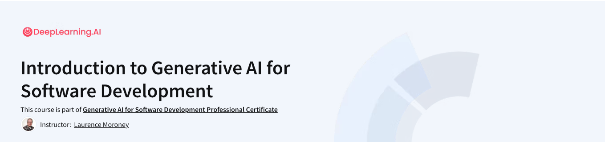

# Coursera: Generative AI for Software Development



[Course](https://www.coursera.org/professional-certificates/generative-ai-for-software-development)

## What you'll learn

- Learn how LLMs work. By knowing how machine learning systems work, you’ll be able to use them more effectively to support your work as a developer.
- Experiment quickly. Using LLMs can speed up your ability to prototype and test new features, allowing you to quickly iterate and ship your code.
- Optimize your code quality. Get to production-ready code faster by working with an LLM to find and fix bugs.
- Team up with AI on engineering tasks. Break through roadblocks and with your team by leveraging an LLM’s knowledge of development roles and tasks.

## Fabric

```sh
cat ai-and-machine-learning.txt | pbcopy
pbpaste | fabric --pattern summarize_paper > ai-and-machine-learning-summarize-paper.md
```

## Lecture Summaries

<!-- BEGIN SUMMARIES -->

### Module 01

- [Ai And Machine Learning Summarize Paper](transcripts/summaries/module-01/ai-and-machine-learning-summarize-paper.md)
- [Intro Conversation Summarize Paper](transcripts/summaries/module-01/intro-conversation-summarize-paper.md)
- [Intro To Transformers Summarize Paper](transcripts/summaries/module-01/intro-to-transformers-summarize-paper.md)
- [Key Transformer Concepts Summarize Paper](transcripts/summaries/module-01/key-transformer-concepts-summarize-paper.md)
- [Machine Learning Summarize Paper](transcripts/summaries/module-01/machine-learning-summarize-paper.md)
- [Supervised Learning Summarize Paper](transcripts/summaries/module-01/supervised-learning-summarize-paper.md)
- [What Is Generative Ai Summarize Paper](transcripts/summaries/module-01/what-is-generative-ai-summarize-paper.md)

### Module 02

- [Assign The Llm A Role Summarize Paper](transcripts/summaries/module-02/assign-the-llm-a-role-summarize-paper.md)
- [Expert Roles For Specialized Knowledge Summarize Paper](transcripts/summaries/module-02/expert-roles-for-specialized-knowledge-summarize-paper.md)
- [Generating Code With Chatbots Summarize Paper](transcripts/summaries/module-02/generating-code-with-chatbots-summarize-paper.md)
- [Giving Llm Feedback Summarize Paper](transcripts/summaries/module-02/giving-llm-feedback-summarize-paper.md)
- [Iterative Prompting Summarize Paper](transcripts/summaries/module-02/iterative-prompting-summarize-paper.md)
- [Level Up With Multiple Roles Summarize Paper](transcripts/summaries/module-02/level-up-with-multiple-roles-summarize-paper.md)
- [Llm Best Practices Summarize Paper](transcripts/summaries/module-02/llm-best-practices-summarize-paper.md)
- [Transformers And Code Summarize Paper](transcripts/summaries/module-02/transformers-and-code-summarize-paper.md)

### Module 03

- [Arrays Summary](transcripts/summaries/module-03/arrays-summary.md)
- [Doubly Linked List Summary](transcripts/summaries/module-03/doubly-linked-list-summary.md)
- [Graded Lab Graphs Summary](transcripts/summaries/module-03/graded-lab-graphs-summary.md)
- [Graphs Summary](transcripts/summaries/module-03/graphs-summary.md)
- [Hash Summary](transcripts/summaries/module-03/hash-summary.md)
- [Intro Summary](transcripts/summaries/module-03/intro-summary.md)
- [Linked List Summary](transcripts/summaries/module-03/linked-list-summary.md)
- [Trees Summary](transcripts/summaries/module-03/trees-summary.md)

<!-- END SUMMARIES -->
