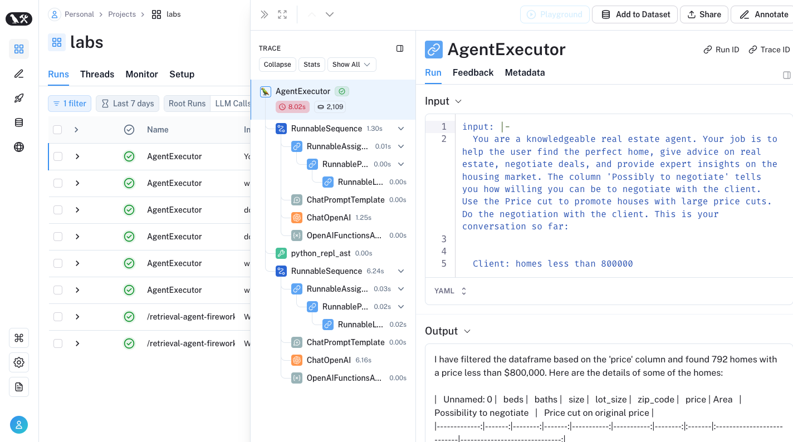

# Code from Article


This is a good explantion and demo.  The streamlit app had an issue loading the supplied
demo dataset, so I removed 900 rows, and it's loading better.

The notebook, is a much better implementation and demonstrates the concept much better.


## Setup

```sh
# build
python3 -m venv venv

# activate
source venv/bin/activate
 
# install requirements
pip install -r requirements.txt

# verify pip install
pip list

# freeze contents to installed.txt
pip freeze > installed.txt

# exit the environment
deactivate
```


## Langsmith



## Reference

[Article](https://towardsdatascience.com/hands-on-building-a-virtual-property-consultant-using-artificial-intelligence-95c2530bf855)